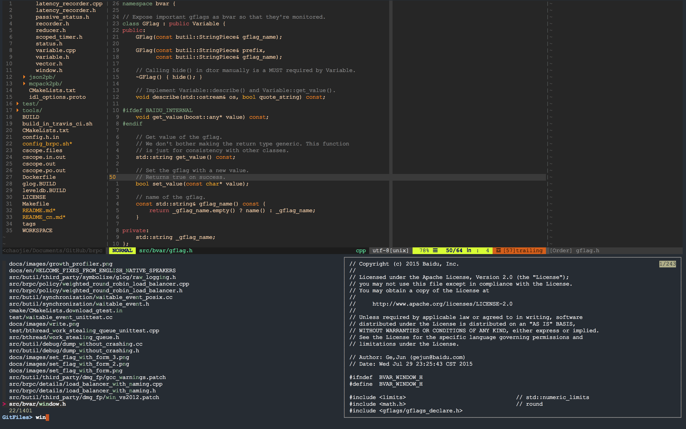
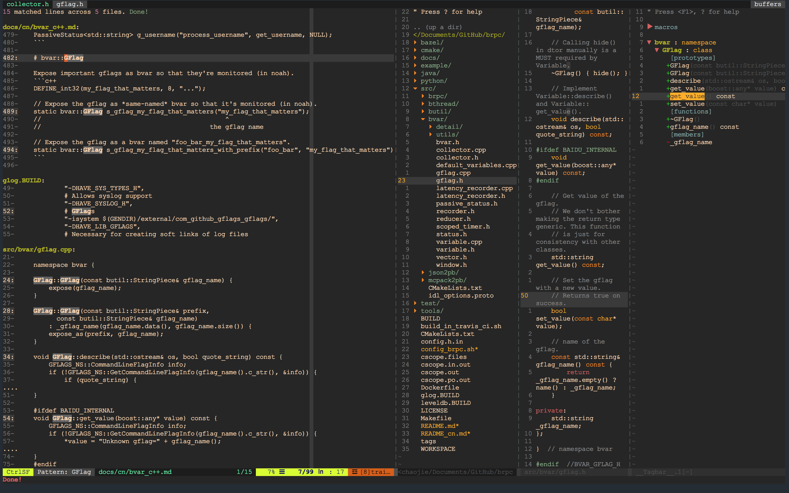

#vim精简配置
## 简介

该代码是一份vim的配置脚本, 遵循以下思路去精简配置：

1. 尽可能不改变vim原生快捷键和配置
2. 尽可能精简插件，只保留当前github最热最实用插件
3. 插件的快捷键尽可能不使用vim原有快捷键，防止覆盖vim原有功能
4. vimrc全部选项提供注释
5. 不使用you-complete-me这种重量级插件，失去vim轻量级开发环境的优势

## 插件列表

精心挑选如下插件列表：

异步lint插件
Plug 'w0rp/ale'            

Go语言插件
Plug 'fatih/vim-go', { 'do': ':GoUpdateBinaries' }

目录树插件
Plug 'scrooloose/nerdtree'
符号列表插件
Plug 'majutsushi/tagbar'

状态栏及状态栏主题插件
Plug 'vim-airline/vim-airline'
Plug 'vim-airline/vim-airline-themes'

括号自动补全插件
Plug 'Raimondi/delimitMate'
代码自动补全插件
Plug 'Shougo/neocomplete.vim'
代码搜索插件
Plug 'dyng/ctrlsf.vim'
文件搜索插件，支持各种搜索
Plug 'junegunn/fzf', { 'dir': '~/.fzf', 'do': './install --all' }
Plug 'junegunn/fzf.vim'

c/c++ 头文件源文件快速切换插件，快捷键(F4)
Plug 'vim-scripts/a.vim'
代码补全插件
Plug 'vim-scripts/AutoComplPop'
支持本地化工程
Plug 'vim-scripts/DfrankUtil'
Plug 'vim-scripts/vimprj'
Doxygen注释风格插件
Plug 'vim-scripts/DoxygenToolkit.vim'

支持mac上自动切换中英文插件
Plug 'CodeFalling/fcitx-vim-osx'
Plug 'CodeFalling/fcitx-remote-for-osx'

## 效果图
### 完整界面

+ 左侧为目录树，按F2打开
+ 右侧为符号列表， 按F9打开
+ 顶上为打开buffer列表，默认打开，为airline功能，可修改配置关闭
+ 底下为状态栏，使用了airline插件的经典状态栏

### 文件搜索功能

按ctrl+p 进入文件搜索功能,由当前最热门的fzf提供搜索支持

除了ctrl+p以外，还有如下搜索快捷键提供各种类型搜索：

nnoremap <c-n>f :FZF<CR>
nnoremap <c-n>g :GFiles?<CR>
nnoremap <c-n>b :Buffers<CR>
nnoremap <c-n>a :Ag<CR>
nnoremap <c-n>r :Rg<CR>
nnoremap <c-n>l :BLines<CR>
nnoremap <c-n>t :BTags<CR>
nnoremap <c-n>m :Marks<CR>
nnoremap <c-n>h :History<CR>
nnoremap <c-n>k :History:<CR>
nnoremap <c-n>/ :History/<CR>
nnoremap <c-n>c :Commands<CR>

### 代码搜索功能

+ 普通模式按F8跳出搜索代码命令，
+ 或visual模块下按F8搜索当前选择单词，
+ 使用ctrlsf插件提供搜索功能，界面如上

## 使用方法
+ git clone https://github.com/Hereasalways/VIM.git
+ mv VIM ~/.vim
+ cp ~/.vim/.vimrc ~/.vimrc
+ 打开vim, 执行:PlugInstall
+ 安装ctags, cscope, astyle, lua, the\_silver\_searcher, fcitx-remote-for-osx, python@2

